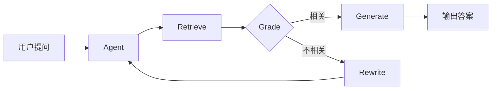

## 🔧 项目简介

最近完成了一个基于 **LangGraph** 的自适应 RAG（检索增强生成）问答系统，支持网页内容索引和智能问答。这个系统不是一个简单的 RAG，而是使用 Agent 循环架构实现自适应检索，当检索效果不佳时会自动重写查询并重试。

本文将分为两部分介绍这个项目，本篇先介绍系统的核心特性和架构设计。

---

## ✨ 核心特性

| 特性 | 说明 |
|------|------|
| 🔄 **自适应检索** | 检索失败时自动重写查询，最多 3 次迭代 |
| 🧠 **LangGraph 工作流** | Agent 式架构：Retrieve → Grade → Rewrite/Generate |
| 📊 **MMR 检索** | 最大边际相关性，平衡相关性与多样性 |
| 🔐 **URL 去重** | 基于哈希的双重检查，防止重复存储 |
| ☁️ **云端向量库** | Qdrant Cloud 持久化存储 |

---

## 🏗️ 技术栈

```
LangChain + LangGraph    # Agent 编排
Qdrant Cloud             # 向量数据库
BGE-small-zh             # 中文 Embedding
GPT-4o-mini              # LLM
Streamlit                # Web UI
```

### 为什么选择这些技术？

- **LangGraph**：相比传统的 LangChain 链式调用，LangGraph 提供了更灵活的状态图模型，非常适合实现 Agent 循环和条件分支
- **BGE-small-zh**：专门针对中文优化的 Embedding 模型，在中文语义理解上表现优异
- **Qdrant Cloud**：支持持久化存储，重启应用后数据不会丢失，且支持高效的向量检索

---

## 📐 系统架构

整个系统采用 Agent 式架构，核心流程如下：



### 工作流程解析

1. **用户提问**：用户输入问题后，系统启动 Agent 处理流程
2. **Retrieve（检索）**：从向量数据库中检索最相关的文档片段
3. **Grade（评估）**：LLM 评估检索到的内容是否与问题相关
4. **Generate（生成）**：如果相关，直接生成答案
5. **Rewrite（重写）**：如果不相关，重写查询语句后重新检索（最多 3 次）

这种自适应机制确保了系统在首次检索效果不佳时，能够通过智能重写查询来提升检索质量。

---

## 🚀 快速开始

### 1. 安装依赖

```bash
uv sync
```

### 2. 配置环境变量

创建 `.env` 文件：

```bash
QDRANT_HOST=your_qdrant_host
QDRANT_API_KEY=your_api_key
OPENAI_API_KEY=your_openai_key
```

### 3. 运行应用

```bash
uv run streamlit run main.py
```

---

## 📝 项目亮点

这个项目有几个值得关注的亮点：

1. **不是简单 RAG** - 使用 LangGraph 实现 Agent 循环，支持自适应重写
2. **工程化思维** - URL 去重、索引优化、旧数据清理
3. **生产级考虑** - 云端向量库、双重检查机制
4. **中文优化** - 使用 BGE 中文模型，按语义切分

{: .notice--info}
**下篇预告**：将深入代码实现，解析核心函数和优化细节。

---

## 📚 相关链接

- [LangGraph 官方文档](https://python.langchain.com/docs/langgraph)
- [Qdrant 向量数据库](https://qdrant.tech/)
- [BGE 中文 Embedding 模型](https://huggingface.co/BAAI/bge-small-zh-v1.5)
