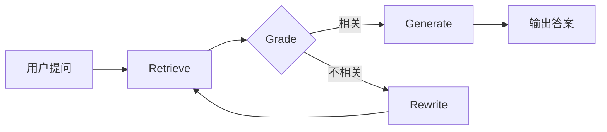

# 🔧 AI Blog Search - 中文 RAG 问答系统

基于 **LangGraph** 的自适应 RAG 系统，支持网页内容索引和智能问答。

## ✨ 核心特性

| 特性 | 说明 |
|------|------|
| 🔄 **自适应检索** | 检索失败时自动重写查询，最多 3 次迭代 |
| 🧠 **LangGraph 工作流** | Agent 式架构：Retrieve → Grade → Rewrite/Generate |
| 📊 **MMR 检索** | 最大边际相关性，平衡相关性与多样性 |
| 🔐 **URL 去重** | 基于哈希的双重检查，防止重复存储 |
| ☁️ **云端向量库** | Qdrant Cloud 持久化存储 |

## 🏗️ 技术栈

```
LangChain + LangGraph    # Agent 编排
Qdrant Cloud             # 向量数据库
BGE-small-zh             # 中文 Embedding
GPT-4o-mini              # LLM
Streamlit                # Web UI
```

## 🚀 快速开始

```bash
# 1. 安装依赖
uv sync

# 2. 配置环境变量 (.env)
QDRANT_HOST=your_qdrant_host
QDRANT_API_KEY=your_api_key
OPENAI_API_KEY=your_openai_key

# 3. 运行
uv run streamlit run main.py
```

## 📐 架构图



## 🔮 未来改进方向

### 1. 检索增强（Retrieval Enhancement）

#### 1.1 切分策略优化

| 策略 | 说明 | 适用场景 |
|------|------|----------|
| **Semantic Chunking** | 按语义边界切分，而非固定长度 | 长文档、多主题内容 |
| **Parent Document Retriever** | 检索子块，返回父文档 | 需要完整上下文时 |
| **Sentence Window** | 检索单句，返回周围 N 句 | 精确匹配 + 上下文 |
| **Recursive Chunking** | 多级递归切分（段落→句子→token） | 结构化文档 |

```python
# Parent Document Retriever 示例
from langchain.retrievers import ParentDocumentRetriever
retriever = ParentDocumentRetriever(
    vectorstore=child_vectorstore,
    docstore=parent_docstore,
    child_splitter=RecursiveCharacterTextSplitter(chunk_size=200),
    parent_splitter=RecursiveCharacterTextSplitter(chunk_size=1000)
)
```

#### 1.2 多路召回（Hybrid Search）

```
Query
  ├─ Dense Retrieval (Embedding) → 语义相似度
  ├─ Sparse Retrieval (BM25)     → 关键词匹配
  └─ Knowledge Graph             → 实体关系
       ↓
   融合排序 (RRF / Linear)
       ↓
   Top-K 结果
```

```python
# Hybrid Search 示例
from langchain.retrievers import EnsembleRetriever
from langchain_community.retrievers import BM25Retriever

bm25 = BM25Retriever.from_documents(docs)
dense = vectorstore.as_retriever()
ensemble = EnsembleRetriever(
    retrievers=[bm25, dense],
    weights=[0.4, 0.6]  # BM25 40%, Dense 60%
)
```

#### 1.3 重排序（Re-ranking）

检索后使用 Cross-Encoder 对结果重排序：

```python
# 使用 Cohere Reranker
from langchain.retrievers import ContextualCompressionRetriever
from langchain_cohere import CohereRerank

reranker = CohereRerank(model="rerank-multilingual-v3.0", top_n=5)
compression_retriever = ContextualCompressionRetriever(
    base_compressor=reranker,
    base_retriever=retriever
)
```

| Reranker | 特点 |
|----------|------|
| Cohere Rerank | 多语言支持好，API 调用 |
| BGE-reranker | 中文效果好，可本地部署 |
| ColBERT | 延迟敏感场景，可预计算 |

### 2. 查询优化（Query Enhancement）

#### 2.1 查询扩展（Query Expansion）

```python
# HyDE: Hypothetical Document Embedding
# 让 LLM 先生成假设性答案，再用答案去检索
prompt = "请为问题生成一个可能的答案片段：{query}"
hypothetical_doc = llm.invoke(prompt)
results = retriever.invoke(hypothetical_doc)
```

#### 2.2 Multi-Query Retrieval

```python
# 将一个问题拆成多个变体，分别检索后合并
from langchain.retrievers import MultiQueryRetriever

multi_retriever = MultiQueryRetriever.from_llm(
    retriever=vectorstore.as_retriever(),
    llm=llm
)
# 自动生成多个查询变体并合并结果
```

#### 2.3 Step-Back Prompting

```
原问题: "林清玄说的那句话是什么？"
      ↓ LLM 抽象化
抽象问题: "文档中提到了哪些名人名言？"
      ↓ 检索
结果: 更广泛的相关内容
```

### 3. 上下文优化（Context Optimization）

#### 3.1 长上下文压缩

```python
# LongContextReorder: 重要内容放两端
from langchain.retrievers import LongContextReorder
reorder = LongContextReorder()
reordered_docs = reorder.transform_documents(docs)
```

#### 3.2 动态 Top-K

```python
# 根据文档质量动态调整返回数量
def adaptive_top_k(scores, threshold=0.7):
    return sum(1 for s in scores if s > threshold)
```

### 4. 多 Agent 协作（推荐）

```
Router Agent → 分类问题类型
    ├─ RAG Agent      → 知识库问答
    ├─ Search Agent   → 实时搜索
    └─ Summary Agent  → 文档摘要
```

### 5. Tool Calling

- 集成外部工具（搜索引擎、计算器、代码执行）
- 让 Agent 自主决定何时调用工具

### 6. 多轮对话

- 对话历史管理
- 上下文压缩（长对话时）
- 指代消解

### 7. RAG 评估

```python
# RAGAS 评估框架
from ragas import evaluate
from ragas.metrics import faithfulness, answer_relevancy, context_precision

result = evaluate(
    dataset,
    metrics=[faithfulness, answer_relevancy, context_precision]
)
```

| 指标 | 含义 |
|------|------|
| Faithfulness | 答案是否忠于检索内容 |
| Answer Relevancy | 答案是否相关 |
| Context Precision | 检索结果是否精准 |
| Context Recall | 检索是否覆盖所有相关信息 |

### 8. 多数据源

- 支持 PDF、Markdown、Notion 等
- 统一的文档解析层

### 9. 流式输出

- Streaming 实时显示生成内容
- 提升用户体验

### 10. 生产级优化

| 优化点 | 方案 |
|--------|------|
| **缓存** | Redis 缓存高频查询结果 |
| **异步** | AsyncIO 并行检索多数据源 |
| **监控** | LangSmith / Weights & Biases 追踪 |
| **AB 测试** | 不同检索策略在线对比 |

## 📝 项目亮点（面试可讲）

1. **不是简单 RAG** - 使用 LangGraph 实现 Agent 循环，支持自适应重写
2. **工程化思维** - URL 去重、索引优化、旧数据清理
3. **生产级考虑** - 云端向量库、双重检查机制
4. **中文优化** - 使用 BGE 中文模型，按语义切分

## 📄 License

MIT
