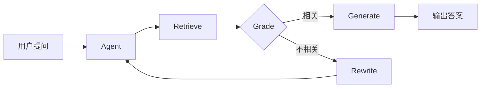

# 🔧 AI Blog Search - 中文 RAG 问答系统

基于 **LangGraph** 的自适应 RAG 系统，支持网页内容索引和智能问答。

## ✨ 核心特性

| 特性 | 说明 |
|------|------|
| 🔄 **自适应检索** | 检索失败时自动重写查询，最多 3 次迭代 |
| 🧠 **LangGraph 工作流** | Agent 式架构：Retrieve → Grade → Rewrite/Generate |
| 📊 **MMR 检索** | 最大边际相关性，平衡相关性与多样性 |
| 🔐 **URL 去重** | 基于哈希的双重检查，防止重复存储 |
| ☁️ **云端向量库** | Qdrant Cloud 持久化存储 |

## 🏗️ 技术栈

```
LangChain + LangGraph    # Agent 编排
Qdrant Cloud             # 向量数据库
BGE-small-zh             # 中文 Embedding
GPT-4o-mini              # LLM
Streamlit                # Web UI
```

## 🚀 快速开始

```bash
# 1. 安装依赖
uv sync

# 2. 配置环境变量 (.env)
QDRANT_HOST=your_qdrant_host
QDRANT_API_KEY=your_api_key
OPENAI_API_KEY=your_openai_key

# 3. 运行
uv run streamlit run main.py
```

## 📐 架构图



## 🔮 未来改进方向

### 1. 多 Agent 协作（推荐）
```
Router Agent → 分类问题类型
    ├─ RAG Agent      → 知识库问答
    ├─ Search Agent   → 实时搜索
    └─ Summary Agent  → 文档摘要
```

### 2. Tool Calling
- 集成外部工具（搜索引擎、计算器、代码执行）
- 让 Agent 自主决定何时调用工具

### 3. 多轮对话
- 对话历史管理
- 上下文压缩（长对话时）
- 指代消解

### 4. RAG 评估
- 集成 RAGAS 评估框架
- 评估指标：Faithfulness、Answer Relevancy、Context Precision

### 5. 多数据源
- 支持 PDF、Markdown、Notion 等
- 统一的文档解析层

### 6. 流式输出
- Streaming 实时显示生成内容
- 提升用户体验

## 📝 项目亮点（面试可讲）

1. **不是简单 RAG** - 使用 LangGraph 实现 Agent 循环，支持自适应重写
2. **工程化思维** - URL 去重、索引优化、旧数据清理
3. **生产级考虑** - 云端向量库、双重检查机制
4. **中文优化** - 使用 BGE 中文模型，按语义切分

## 📄 License

MIT
